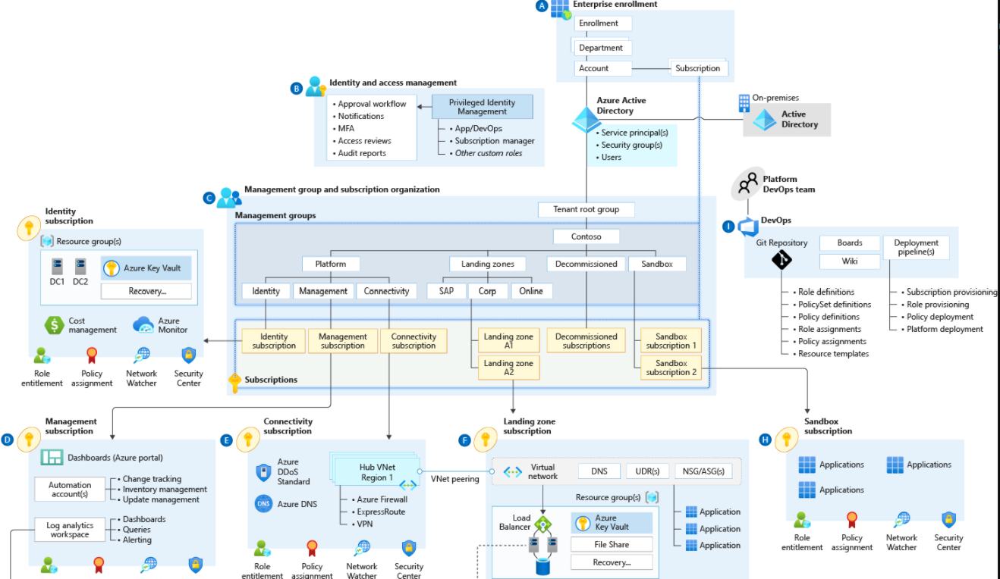

# Azure Landing Zones

Azure landing zones(ALZ) are the output of a multisubscription Azure environment that accounts for scale, security governance, networking, and identity. Azure landing zones enable application migration, modernization, and innovation at enterprise-scale in Azure. These zones consider all platform resources that are required to support the customer's application portfolio and don't differentiate between infrastructure as a service or platform as a service.

ALZ is a way to implement your Cloud Adoption Framework. That doesn't mean it states what technology to use. In the following exersices, you can choose you own.

the [public documentation](https://docs.microsoft.com/en-us/azure/cloud-adoption-framework/ready/landing-zone/implementation-options#implementation-options) gives a few examples.

In the upcoming exercises, we will create a full landing zones setup like below.

[back](../Infrastructure.md.md) <--- [TO OVERVIEW](../Infrastructure.md) ---> [next](./infra-alz-1.md)