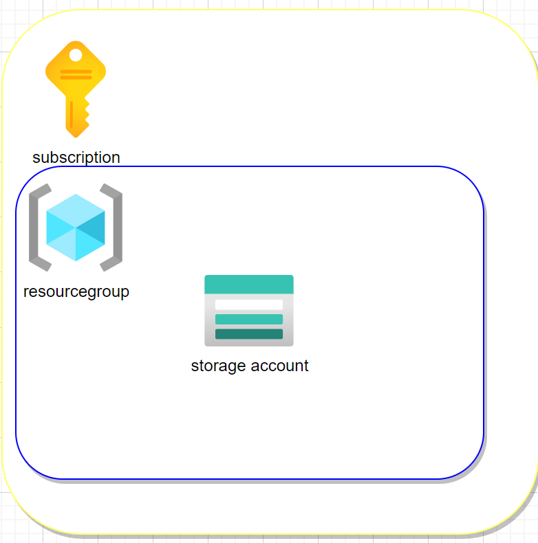

# infra-basics-1

## Description

Constoso needs storage in the cloud to store templates that can be used accros the organization. They want to store ARM templates for reuse within the organization. Hence, they desire the use of ARM templates for the deployment of the storage account. They have already been experimenting with the Azure CLI for the deployement in azure. They use commands like `az group create` and `az deployment group create` to deploy to Azure.

## Outcome

Create a basic storage account in Azure. Make sure it is a StorageV2 account with a Locally Redundant Zone. One template is enough for now (no parameter files needed). If desired PowerShell could be used as well. Make sure the solution looks something like:

## References

It is not mandantory to use these references.

- [Azure Resource Manager documentation](https://docs.microsoft.com/en-us/azure/azure-resource-manager/)
- [Azure Architecture Center](https://docs.microsoft.com/en-us/azure/architecture/)
- [VS Code documentation](https://code.visualstudio.com/Docs)
- [Azure CLI](https://docs.microsoft.com/en-us/cli/azure/reference-index?view=azure-cli-latest)
- [WSL](https://docs.microsoft.com/en-us/windows/wsl/about)
- [Azure PowerShell](https://docs.microsoft.com/en-us/powershell/azure/?view=azps-6.6.0)

[back](./infra-basics-1.md) <--- * ---> [next](./infra-basics-2.md)
