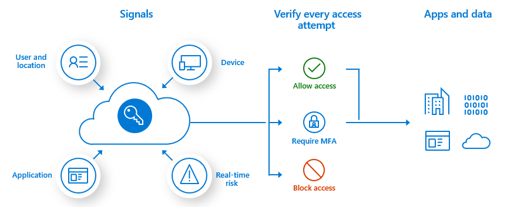

# Identity-3 Conditional Access

## Description

This quest assumes that you already completed the [secure cloud identities](./Identity-2.md) quest.

Now that Constoso implemented the tools and services that enable securing and protecting their the identities in the cloud, they look for a way to enforce these in an effective way. The change management team is concerned that if users would be prompted with an MFA for all access from any devices they use that would highly degrade the user experience for the newly introduced cloud services, especially the access of Microsoft 365 features. However they understand the importance of validating access requests with MFA, especially for administrative access. They need to find a balance that enables protection of credentials when needed, but also minimizes the distruption to the users. Contoso considers managed devices (Azure AD joined) secure enough to allow login without MFA requirements.

## Outcome

Setup Conditional Access (CA) configuration that meets the following requirements
- Users logging in from Azure AD Domain joined devices do not have to use MFA authenticaton when accessing Microsoft 365 services. 
- Login from non-managed (insecure) devices should require an MFA when accessign the same Microsoft 365 services
- Azure Administrators always have to leverage MFA when loggin into Azure Management Portal (either from managed or unmanaged devices)
- In case of a risky signin is detectedm the user must requested to change the password

*Tip! Deploy a Windows 10 machine and Azure AD join that for scenarios in this quest*

## Review and discussion
Why would you recommend conditional access? How would you argue if the customer would say that they already have a strong authentication method in place, so they do not see a reason for planning conditional access?
Compare the following two approaches: "Enabling MFA for all accounts and all accesses" vs. "Leverage sophisticated conditional access policies that involves user, device, application and risks". Which would you recommend and why? Which do you think is more secure and why?
What would be your 'elevator pitch' for a customer on Conditional? What would be the top 3-4 things that would highlight to a customer executive on Conditional access?

If you want to talk through or validate your quest after you completed, contact [Matyas Safranka](mailto:matyas@microsoft.com) via email or Teams.

## References

It is not mandatory to use these references.

- [Conditional Access](https://docs.microsoft.com/en-us/azure/active-directory/conditional-access/overview)
- [What is Identity Protection?](https://docs.microsoft.com/en-us/azure/active-directory/identity-protection/overview-identity-protection)
- [Azure AD joined devices](https://docs.microsoft.com/en-us/azure/active-directory/devices/concept-azure-ad-join)
- [Tutorial: Configure hybrid Azure Active Directory joined devices manually](https://docs.microsoft.com/en-us/azure/active-directory/devices/hybrid-azuread-join-manual)
- [Tutorial: Configure hybrid Azure Active Directory join for managed domains](https://docs.microsoft.com/en-us/azure/active-directory/devices/hybrid-azuread-join-managed-domains)
- [Tutorial: Configure hybrid Azure Active Directory join for federated domains](https://docs.microsoft.com/en-us/azure/active-directory/devices/hybrid-azuread-join-federated-domains)
- [Plan a Conditional Access deployment](https://docs.microsoft.com/en-us/azure/active-directory/conditional-access/plan-conditional-access)
- [Conditional Access: Require MFA for Azure management](https://docs.microsoft.com/en-us/azure/active-directory/conditional-access/howto-conditional-access-policy-azure-management)
- [Conditional Access: Sign-in risk-based Conditional Access](https://docs.microsoft.com/en-us/azure/active-directory/conditional-access/howto-conditional-access-policy-risk)

[back](./Identity-2.md) <--- * ---> [next](./Identity-4.md)
