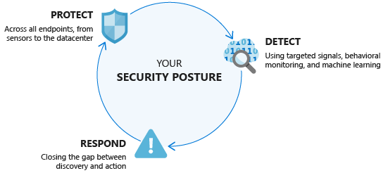

# Security

Identity is the new security boundary in the cloud, therefore it is recommended that you start the security track with understanding identities.


Security in the cloud relies on Protect, Detect and Response approach. Identities are the first line of defense in protecting cloud resources. Classic practices of least priviledged acces, or the [Ten immutable laws of security](https://docs.microsoft.com/en-us/previous-versions/cc722487(v=technet.10)) and [Ten immutable laws of secure administration](https://docs.microsoft.com/en-us/previous-versions/cc722488(v=technet.10)) are still relevanty. Still yt would be very naive to think that it is possible to have an unpenetrable defense; It is practically impossible to protect from all types and forms of threat in the modern cloud era. Therefore being always on alert, and focusing on being able to detect different forms of threats and being able to respond to them is the only way to approach security in the cloud.



Therefore the security related quests are organized around the following grouping:
- [identity](Identity/Identity-1.md)
- [security basics](Basics/security-basics-1.md)
- [sentinel](Sentinel/Sentinel-path1.md)

```
.
├──. Security and Identity
   ├──. Identity
      ├── Identity-1 # Hybrid-Identity
      ├── Identity-2 # Securing Identities in the Cloud
      ├── Identity-3 # Conditional Access
      ├── Identity-4 # Priviledged Identity Management
      ├── Identity-5 # B2B
   ├──. Security FundamentaBasicsls
      ├── security-basics-1  # Role Based Access
      ├── security-basics-2  # Understand Storage Account security
      ├── security-basics-3  # Microsoft Defender for Cloud
      ├── security-basics-4  # Security Score
      ├── security-basics-5  # Governance with Policies
      ├── security-basics-6  # Remediation with Policies
      ├── security-basics-7  # Custom Policies
   ├──. Sentinel
      ├── Sentinel-path1 # Introduction to Azure Sentinel
      ├── Sentinel-path2 # Introduction to KQL
      ├── Sentinel-path3 # Automate responses
 ```
